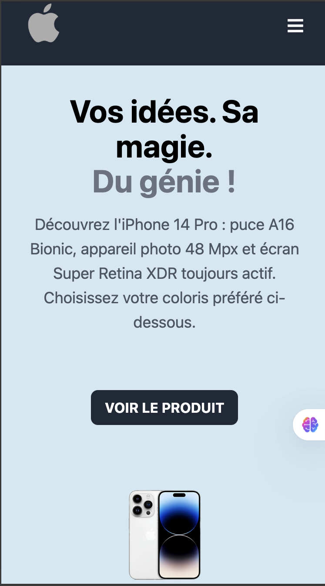

# Iphone-product-page

# 🍎 Apple Project — Page produit iPhone

Page produit interactive inspirée du style Apple, avec sélecteur de coloris dynamique. Réalisée en HTML, Tailwind CSS et JavaScript vanilla.


 **[Voir le site en direct](https://veben-cmyk.github.io/Iphone-product-page/)**

## 🖼️ Aperçu



## ✨ Fonctionnalités

- Sélecteur de coloris interactif : cliquer sur une miniature change l'image principale du produit
- Indicateur visuel de sélection : un anneau apparaît autour de la miniature actuellement choisie
- Couleur de fond dynamique, assortie au coloris sélectionné, avec transition douce
- Menu mobile responsive (burger menu)
- Bouton "Voir le produit" avec défilement fluide vers le sélecteur de coloris
- Design épuré inspiré des pages produit Apple

## 🛠️ Stack technique

- **HTML5** — structure sémantique de la page
- **Tailwind CSS** (via CDN) — mise en forme utilitaire
- **JavaScript vanilla** — interactivité (sélecteur de coloris, menu mobile, scroll fluide)

## 📁 Structure du projet

```
apple-project/
├── index.html
├── src/
│   ├── logo.png
│   ├── Iphone-01.png    # Coloris Violet Intense
│   ├── Iphone-02.png    # Coloris Or
│   ├── Iphone-03.png    # Coloris Argent
│   └── script.js
├── LICENSE
└── README.md
```

## Lancer le projet en local

Aucune installation ni dépendance requise : le projet est une page statique.

1. Clone le dépôt
   ```bash
   git clone https://github.com/veben-cmyk/apple-project.git
   cd apple-project
   ```
2. Ouvre `index.html` dans ton navigateur, ou utilise *Live Server* (VS Code) pour le rechargement automatique.

## Workflow Git (Gitflow)

| Branche | Rôle |
|---|---|
| `main` | Code stable, prêt à être déployé/présenté |
| `develop` | Branche d'intégration des nouvelles fonctionnalités |
| `feature/*` | Une branche par fonctionnalité |
| `fix/*` | Correction de bug isolée |

Convention de commit : [Conventional Commits](https://www.conventionalcommits.org/) (`feat:`, `fix:`, `docs:`, `style:`...).

## 📌 Améliorations futures

- [ ] Mettre à jour dynamiquement le `alt` de l'image principale selon le coloris sélectionné
- [ ] Ajouter d'autres modèles/variantes de produit
- [ ] Page de détails techniques complète (fiche produit)

## 👤 Auteur

**Veben Isaac**
- GitHub : [@veben-cmyk](https://github.com/veben-cmyk)
- LinkedIn : [Veben Isaac](https://www.linkedin.com/in/isaac-veben-6ab4093a9/)

## 📄 Licence

Ce projet est sous licence MIT — voir le fichier [LICENSE](LICENSE) pour plus de détails.